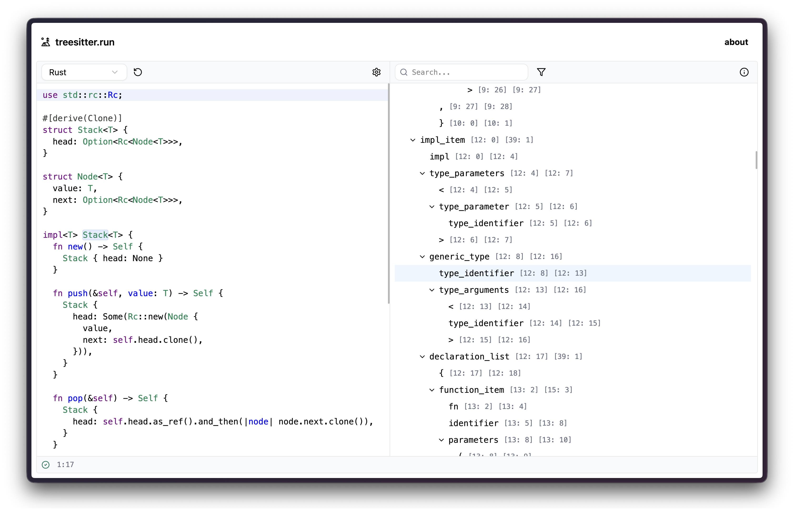

##  treesitter.run

[](https://github.com/terror/treesitter.run/actions/workflows/ci.yaml)

[`treesitter.run`](https://treesitter.run/) is a web playground for tree-sitter.



`treesitter.run` lets you explore and query syntax trees in the browser,
including:

- Edit source code with CodeMirror, syntax highlighting, diagnostics, and
  optional Vim keybindings.

- Switch between 140+ bundled tree-sitter parsers without installing anything
  locally.

- Browse the full syntax tree with expandable nodes, search, and filters for
  named, anonymous, extra, missing, and error nodes.

- Run tree-sitter queries live and see captures highlighted in both the source
  editor and syntax tree.

- Inspect parser metadata and reset sample buffers for each language.

If you need help with `treesitter.run`, please feel free to open an issue.
Feature requests and bug reports are always welcome!

## Usage

The hosted version is available at <https://treesitter.run>.

Choose a language from the dropdown, edit the source buffer, and the syntax tree
will update as you type. Use the query pane to run tree-sitter queries against
the current tree:

```scheme
(function_declaration
  name: (identifier) @function)
```

Matching nodes are highlighted in the tree and source editor. The capture count
is shown above the query editor, and query parse errors are reported inline.

The tree pane can be searched by node type. Filters can hide anonymous nodes,
extras, parse errors, missing nodes, or named nodes when you want to focus on a
specific part of the tree.

Editor settings are stored locally in the browser and include line numbers, word
wrap, tab size, font size, keybindings, and syntax theme.

## Development

The web app lives in `www` and is built with React, Vite, CodeMirror, and
web-tree-sitter. The parser management tooling is a Rust binary in `src`.

Install web dependencies:

```bash
just web-install
```

Start the web app:

```bash
just web-dev
```

Run the Rust and TypeScript test suites:

```bash
just test
just web-test
```

Below is the output of `treesitter-run --help`:

```console
Manage the tree-sitter parsers bundled by treesitter.run

Usage: treesitter-run <COMMAND>

Commands:
  add      Add a parser from a GitHub repository to the manifest and build it
  check    Verify that bundled parser WASM files load and parse successfully
  compile  Build parser WASM files into the web app's public asset directory
  update   Refresh parser revisions in the manifest from their upstream repositories
  help     Print this message or the help of the given subcommand(s)

Options:
  -h, --help     Print help
  -V, --version  Print version
```

### Parsers

Parsers are listed in `manifest.json`. Each entry records the parser name,
GitHub repository, optional grammar subdirectory, and pinned revision. Built
parser artifacts are committed under `www/public` as `tree-sitter-*.wasm`.

To add a parser:

```bash
cargo run -- add --name foo --repository owner/tree-sitter-foo
```

If the grammar is not at the repository root, pass `--path`:

```bash
cargo run -- add --name foo --repository owner/tree-sitter-foo --path grammar
```

To rebuild one or more parsers:

```bash
cargo run -- compile --parsers rust python
```

To refresh pinned revisions from upstream repositories:

```bash
cargo run -- update --parsers rust python
```

When `--parsers` is omitted, `compile`, `check`, and `update` operate on every
parser in the manifest.

Highlight queries are copied from `queries/tree-sitter-*.highlights.scm` when a
local override exists, otherwise from the upstream parser repository when it
provides `queries/highlights.scm`.

## Prior Art

Check out [tree-sitter](https://tree-sitter.github.io/tree-sitter/), the parser
generator tool and incremental parsing library.
